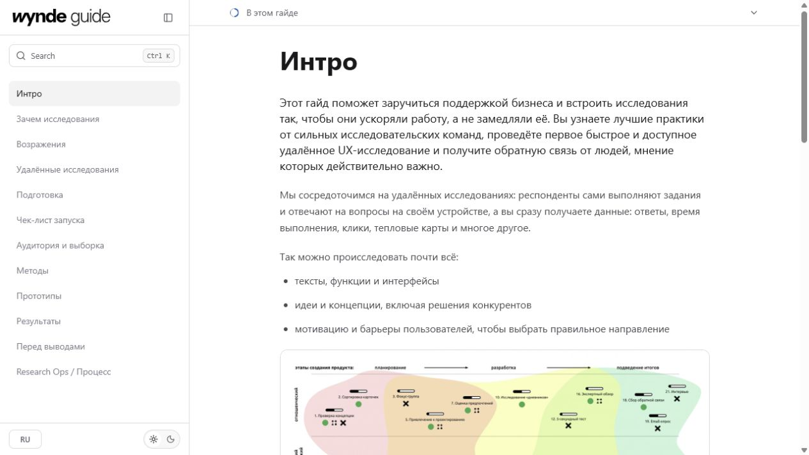
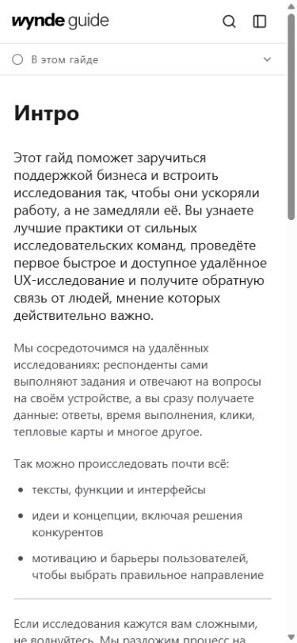
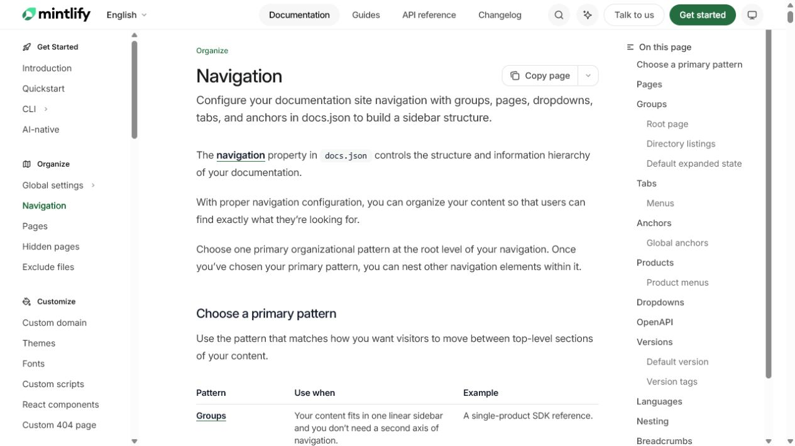
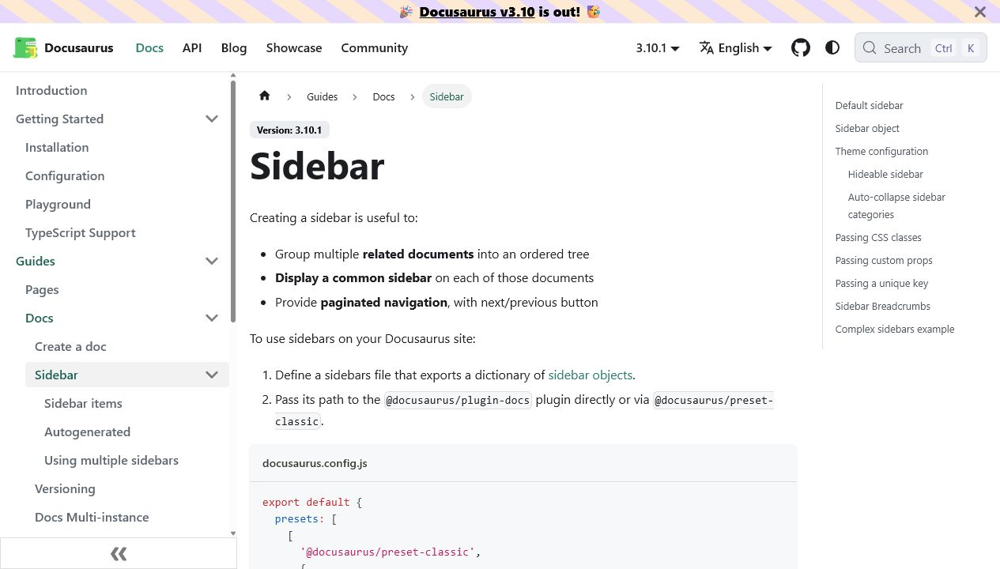

# Аудит версий Wynde UX Research Guide

Дата: 10 июля 2026

## TL;DR

Отдельной «лучшей свежей ветки» сейчас нет: `main`, `codex/design-system-foundation` и `codex/wynde-design-system-layer` указывают на один commit `1a18423`. Свежий дизайн существует только как незакоммиченный patch в текущем worktree.

Лучшей базой остаётся `main@1a18423`. Из свежего patch стоит сохранить вынос `ArticleBlocks.tsx`, но не принимать новый visual/token layer целиком. Целевой вариант: `1a18423` + desktop-группы навигации из `1f2141b` + semantic tokens, которые alias'ят Figma/Wynde tokens, + исправленный content pipeline и browser-level interaction tests.

## Текущее состояние


*Dirty working tree: визуально почти тот же shell, что main, с более синим selected state и Primer/GitHub-палитрой.*


*`main@1a18423`: тот же набор основных interactive surfaces и почти та же композиция.*

На mobile различия также косметические:




## Сравнение версий

| Версия | Интерактивность | UI / IA | Инфраструктура | Вердикт |
|---|---|---|---|---|
| `9365db5` | Базовые ToC/shortcut-механики, часть chrome была заглушкой | Generic mobile chrome, слабая продуктовая релевантность | Начальная | Не использовать |
| `1f2141b` | Search, sidebar collapse, theme, mobile menu/contents | Лучшее desktop-группирование глав | Хорошая, но content rendering слабее | Источник отдельных решений |
| `1a18423` | Практически тот же набор, но лучше content semantics | Desktop IA уплощена | Лучший committed baseline | База |
| Dirty design-system patch | Нового поведения почти нет | Primer-like reskin, не системный Wynde update | Полезный вынос ArticleBlocks, но дублирующая token/CSS-система | Не принимать wholesale |

## Что уже работает

- Реальный поиск по главам и заголовкам; `Ctrl/Cmd+K`, Escape и фильтрация.
- Mobile guide drawer и отдельное page contents состояние.
- Scroll-driven active section и progress через `IntersectionObserver`.
- Light/dark theme с сохранением в `localStorage`.
- Семантические списки, quotes, examples, Help Center link после `1a18423`.
- Текущий patch проходит 33/33 Node tests, lint, typecheck и `git diff --check`.

## Blocker

Названия design-system веток не представляют разные версии. Их diff пуст, unique commits отсутствуют, а незакоммиченные файлы могут пережить checkout. До выбора/слияния свежий patch нужно сохранить отдельным snapshot/commit и только затем делить на принимаемые и отклоняемые части.

## Major

### 1. Visual update почти не материализовался

Сравнение двух desktop и двух mobile screenshots показывает одинаковую геометрию, тип контента и interaction surfaces. Свежий слой в основном заменяет CSS variables и button wrappers, поэтому результат ощущается как «слегка перекрашенный main», а не консистентное обновление docs UI.

### 2. Новый token layer обходит Figma source of truth

`app/design-system.css` вручную задаёт GitHub/Primer-подобные цвета (`#f6f8fa`, `#0969da`, dark canvas `#0d1117`) и фиксированную типографику 32/24 px. При этом `app/figma-tokens.css` задаёт Wynde desktop 40/30 px и mobile 28/22 px. Семантический слой должен alias'ить Figma variables, а не подменять их отдельной системой.

### 3. Desktop и mobile имеют разную информационную архитектуру

Desktop `GuideNavigation` делает `flatMap` всех групп в один список; mobile показывает те же группы с заголовками. Это ухудшает scanning и закрепляет разный mental model по breakpoints.


*Mintlify: group headings, active item, page description и отдельный right-side ToC создают явную трёхуровневую иерархию.*


*Docusaurus: nested/collapsible ordered tree, breadcrumbs, section identity и right-side ToC.*

Официальные Mintlify и Docusaurus docs описывают sidebar именно как иерархию групп/категорий, а не плоский список.

### 4. Богатые article primitives не питаются реальными данными

- Неопознанные Notion callouts массово превращаются в один `example` variant.
- Toggle импортируется только с title, поэтому открывается пустым.
- Notion tables становятся `rawTable` paragraph, хотя structured table renderer существует.
- `steps`, `pathway`, `related` и templates не создаются текущим adapter pipeline.
- `column_list` частично деградирует или теряет image-only blocks.

Пока это не исправлено, дальнейшая полировка карточек умножает визуальную монотонность, а не усиливает Wynde.

### 5. Интерактивность есть, но организационно хрупкая

`GuideShell.tsx` — крупная client boundary с шестью состояниями, search, overlay coordination, theme, observer, article rendering и previous/next navigation. Внутренние переходы используют обычные `<a>`, поэтому делают full reload. Диалоги объявлены как `aria-modal`, но без focus trap, возврата фокуса и inert background.

Browser-проверка также обнаружила общий для main и candidate дефект: после collapse верхний sticky ToC перекрывает collapsed rail, поэтому `Expand sidebar` не получает pointer hit. Это не регрессия свежего patch, а пробел существующих tests.

## Minor

- Desktop search пуст до ввода; mobile сразу показывает первые результаты.
- Нет ArrowUp/ArrowDown/active-option поведения в поиске.
- `Ctrl K` показывается и на macOS, хотя handler поддерживает Cmd+K.
- English route наследует `<html lang="ru">`.
- Theme initialization может дать light-to-dark flash.
- UI tests в основном regex-проверяют source/CSS, а не DOM behavior, focus, routing и viewport states.
- `GuideSurface`, `GuideCard`, `GuideBadge` экспортированы и тестируются, но production их не использует.

## Рекомендации

1. **Взять `1a18423` как canonical base.** Не откатываться на `1f` целиком.
2. **Перенести только удачные части:** `ArticleBlocks.tsx` и desktop group headings из `1f`.
3. **Пересобрать token contract:** primitive values остаются в Figma export; semantic Wynde aliases описывают intent; component tokens не содержат новую независимую палитру.
4. **Сначала исправить content adapter:** callout semantics, toggle children, column lists и structured tables.
5. **Затем усилить docs UX:** breadcrumbs/eyebrow, grouped sidebar, stable right-side ToC на wide screens, product-specific checklists/templates/examples.
6. **Добавить реальные interaction tests:** collapse/expand hit testing, search keyboard navigation, focus containment/restore, RU/EN lang, 390/1280/1440 viewport snapshots.

Целевой shell:

```text
┌───────────────┬──────────────────────────────┬──────────────┐
│ Wynde + search│ eyebrow / breadcrumb         │ On this page │
│               │ H1 + concise chapter intro   │ active H2    │
│ НАЧАЛО        │                              │ nested H3    │
│ • Интро       │ semantic article blocks      │              │
│ • Зачем       │ examples / checks / template │              │
│ ПОДГОТОВКА    │                              │              │
│ • Чек-лист    │ previous / next              │              │
└───────────────┴──────────────────────────────┴──────────────┘
```

## Ready as prototype

- `1a18423`: да, как functional prototype baseline.
- Dirty design-system patch: нет, как единый UI update; пригоден как источник двух-трёх отдельных изменений.

## Проверка

- Git refs, reflogs, merge-base, remote heads и file-level diffs.
- Рендер current/main: desktop 1280×720 и mobile 390×844.
- Ручные проверки search/filter, mobile drawer, mobile contents, theme, collapse hit testing.
- Tests: 33/33; lint, typecheck и `git diff --check` прошли.
- Lazyweb quick search: strong coverage, top similarity 0.61.
- Hosted Lazyweb report не завершился из-за внешнего backend rate limit HTTP 429; локальный анализ продолжен по полученным Lazyweb refs и живым официальным страницам.

## Источники

- [Mintlify navigation](https://www.mintlify.com/docs/organize/navigation)
- [Mintlify pages and standard sidebar + ToC layout](https://mintlify.com/docs/pages)
- [Docusaurus sidebar](https://docusaurus.io/docs/sidebar)
- [GitBook site structure](https://gitbook.com/docs/publishing-documentation/site-structure)
