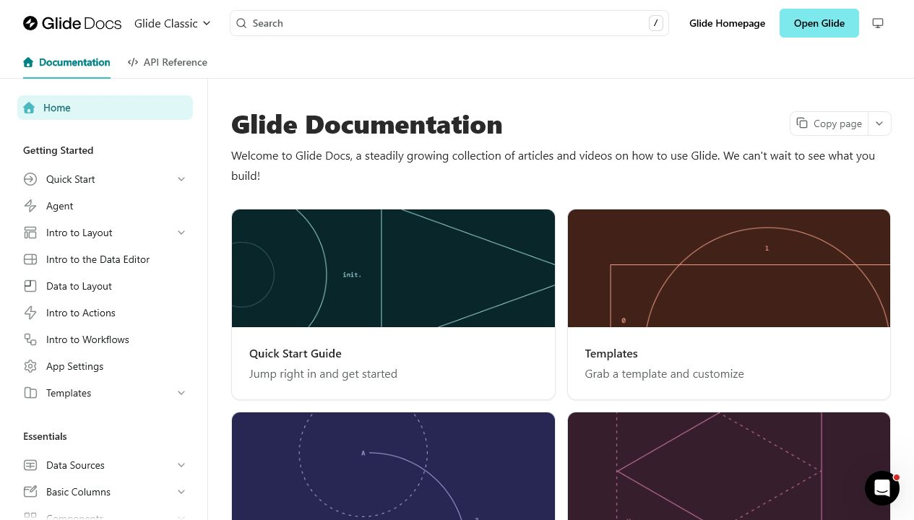
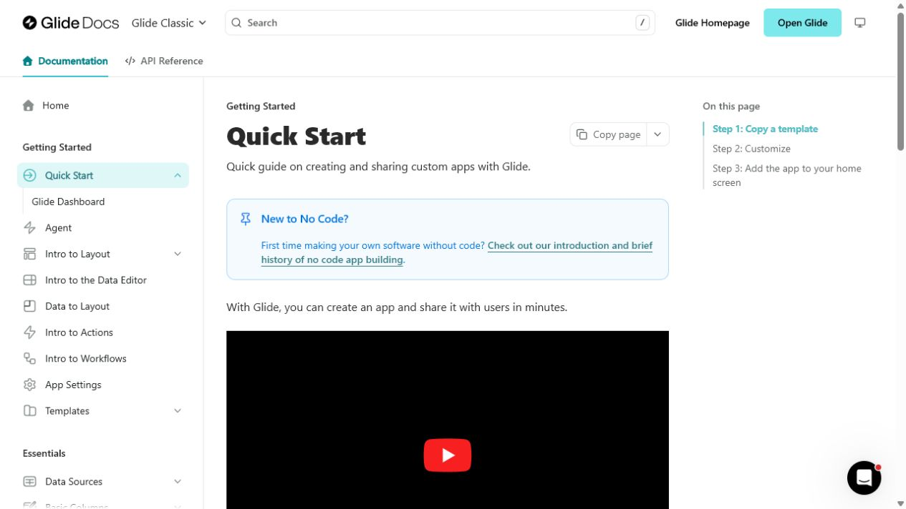
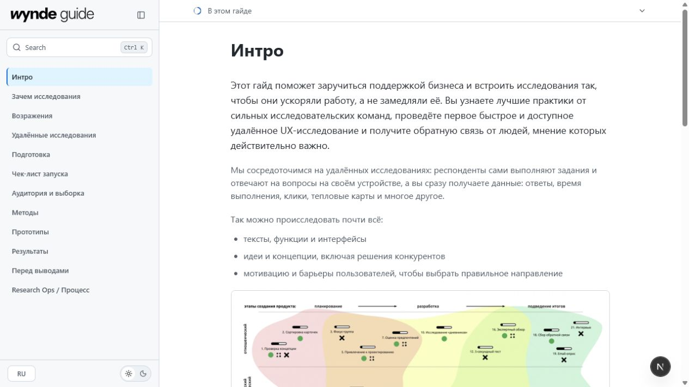
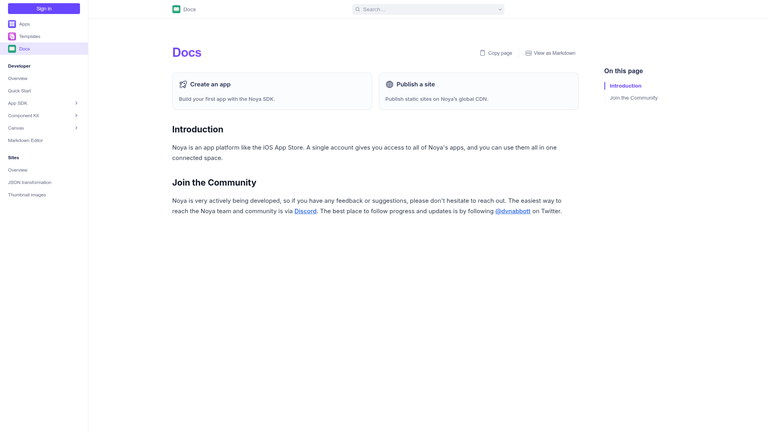

# Стратегия UI и docs-инфраструктуры для Wynde Guide

Дата: 10 июля 2026

## Решение

Для Wynde оптимальна **гибридная архитектура**, но без немедленной wholesale-миграции:

- визуальный слой остаётся собственным и следует Figma/Wynde;
- контент остаётся в текущем RU/EN источнике данных;
- **Fumadocs Core** рассматривается только как узкий server-side source/page-tree/search layer и принимается лишь если spike реально удаляет больше собственного кода, чем добавляет adapter-кода;
- Glide Docs и Fern используются как UX-эталон, но не как готовая тема для текущего Next.js-приложения.

Практическая база — `main@1a18423`: сохранить текущий shell и Figma visual layer, перенести из dirty patch только полезные product-specific article blocks и не принимать новый generic `design-system.css` как основу. Полную миграцию на Fern стоит выбирать только при другом продуктовом решении: отказаться от собственного UI и принять hosted docs-платформу вместе с её контентной моделью, Enterprise-зависимостями и ограничениями.

## Почему попытка с «готовым builder UI» дала странный результат

Проблема не в том, что docs builders неспособны давать хороший интерфейс. Проблема в смешении трёх разных слоёв:

1. **Visual source of truth** — Figma-токены, геометрия, типографика, состояния и Wynde-компоненты.
2. **Docs infrastructure** — дерево страниц, маршруты, поиск, ToC, breadcrumbs, i18n, keyboard/focus behavior.
3. **Hosted renderer/theme** — Fern, Mintlify и другие платформы, которые ожидают, что контент и конфигурация будут перенесены в их систему.

Текущий незакоммиченный design-system patch не мигрирует проект на docs framework. Он сохраняет самописный `GuideShell`, но поверх Figma-токенов вводит второй, Primer/GitHub-подобный visual layer в `app/design-system.css`. В результате:

- точность относительно Figma уменьшается;
- нового поведения почти не появляется;
- инфраструктурная сложность остаётся в проекте;
- desktop navigation теряет группы, хотя mobile navigation их сохраняет.

Это худшая середина между двумя валидными стратегиями: ни точный Wynde UI, ни полноценная hosted docs-платформа.

## Что на самом деле представляет собой Glide Docs

Проверка production HTML показала, что [Glide Docs](https://www.glideapps.com/docs) собран на **Fern**: в документе есть Fern generator metadata, ассеты с `app.buildwithfern.com` / `files.buildwithfern.com` и Fern-специфичные CSS-селекторы.

Но Glide Docs — не стандартный Fern theme. Поверх платформы используются:

- собственный variable font;
- custom CSS;
- custom JavaScript;
- product theme и переключатель продуктовых разделов;
- изменённые navbar actions, sidebar и breadcrumb behavior.

Следовательно, builder дал Glide инфраструктурный каркас, а качество и узнаваемость UI появились благодаря отдельной дизайн-работе.





## Визуальный контекст

Текущий Wynde уже имеет подходящий трёхколоночный docs shell и собственный визуальный язык. Проблема сейчас не в отсутствии основы, а в несогласованной границе ответственности и в недоведённых состояниях/иерархии.



Другие зрелые docs-интерфейсы подтверждают устойчивый паттерн: сгруппированное дерево слева, читаемая статья в центре, локальный ToC справа и поиск как отдельная interaction surface.




## Сравнение вариантов

| Вариант | Figma fidelity | Инфраструктурная экономия | Миграционная цена | RU/EN и custom blocks | Итог |
|---|---:|---:|---:|---:|---|
| Полная миграция на Fern | Средняя без глубокой темы; высокая после кастомизации | Высокая | Высокая | Потребует переноса контента; часть возможностей зависит от плана | Только если команда сознательно выбирает hosted platform |
| Полный `fumadocs-ui` | Средняя | Высокая | Средняя | Хорошая, но UI придётся переподчинить теме Fumadocs | Не нужен: заменяет уже удачный visual layer |
| **Fumadocs Core headless + Wynde UI** | **Высокая** | **Высокая в commodity-слое** | **Низкая/средняя, инкрементальная** | **Текущий JSON и blocks можно сохранить через source adapter** | **Рекомендуется** |
| Полностью самописный Next.js shell | Максимальная | Низкая | Низкая сейчас, высокая со временем | Максимальная | Допустимо, но продолжает накапливать инфраструктурный долг |

## Почему headless Fumadocs подходит текущему репозиторию

[Fumadocs Core](https://www.fumadocs.dev/docs/headless) отделён от `fumadocs-ui` и предоставляет headless primitives для Next.js: source/page tree, breadcrumbs, ToC, search и routing helpers. [Static/custom Source](https://www.fumadocs.dev/docs/headless/source-api/source) позволяет обернуть существующие данные, не переводя весь guide в MDX. [Orama search](https://www.fumadocs.dev/docs/headless/search/orama) может работать локально и поддерживает locale mapping для русского и английского.

Важное ограничение актуальной версии: после [Fumadocs v16](https://www.fumadocs.dev/blog/v16) отдельный headless sidebar component больше не является частью Core. Поэтому `GuideNavigation` и `MobileChrome` не заменяются готовой оболочкой: они остаются Wynde-компонентами и получают единое дерево данных из Core. Это ограничение здесь полезно — оно не даёт framework theme перехватить визуальный слой.

Это соответствует текущей архитектуре:

- `content/guideStructure.ts` уже содержит RU/EN структуру;
- `content/guide.ts` уже выполняет роль adapter layer;
- `components/guide/ArticleBlocks.tsx` может остаться Wynde renderer;
- `app/figma-tokens.css`, `figma-tokens/` и `public/figma/` остаются visual source of truth;
- из `components/guide/GuideShell.tsx` можно постепенно вынести самописные page-tree, search, scrollspy и routing concerns.

## Целевая граница ответственности

```text
Localized Wynde content (RU / EN JSON)
                    │
                    ▼
        WyndeSourceAdapter / StaticSource
                    │
                    ▼
              Fumadocs Core
       page tree · URLs · i18n · search
       breadcrumbs · ToC data · metadata
                    │
                    ▼
          Next.js App Router shell
                    │
                    ▼
              Wynde UI layer
  Figma tokens · sidebar · article blocks
  mobile chrome · exact responsive states
                    │
                    ▼
         Small client interaction islands
 search dialog · mobile drawers · theme · focus
```

### Wynde/Figma должны владеть

- типографикой, цветом, spacing и радиусами;
- desktop/mobile композицией;
- sidebar row, active/hover/focus states;
- search dialog presentation;
- callouts, checklists, tables, toggles, media и другие article blocks;
- брендированием и всеми assets.

### Docs core должен владеть

- каноническим page tree;
- slug/URL generation;
- locale-aware source;
- breadcrumbs и previous/next relations;
- search index/query primitives;
- ToC extraction/data;
- route/static params и metadata helpers.

### Не следует смешивать

- Figma tokens и отдельную вручную придуманную generic token system;
- текущий custom shell и куски hosted Fern/Mintlify theme;
- две независимые модели навигации для desktop и mobile;
- контентный adapter и UI-specific fallback heuristics.

## Когда всё-таки выбирать Fern

[Fern](https://buildwithfern.com/learn/docs/getting-started/how-it-works) подходит, если приоритет меняется с «точный Wynde/Figma UI» на «меньше владеть docs product вообще». Тогда нужно мигрировать целиком:

- перенести контент в Markdown/MDX и `docs.yml`;
- отдать Fern навигацию, поиск, rendering и hosting;
- реализовать Wynde branding через [global themes](https://buildwithfern.com/learn/docs/customization/global-themes) и [custom CSS/JS](https://buildwithfern.com/learn/docs/customization/custom-css-js);
- проверить RU/EN, custom blocks и ограничения выбранного тарифного плана.

Fern нельзя корректно использовать как npm-тему поверх существующего Wynde shell. Такой вариант снова создаст двойную систему.

## Следующий безопасный шаг

Сейчас не требуется устанавливать Fumadocs или другой framework. До изменения зависимостей нужен один вертикальный prototype chapter, который проверит всю гипотезу, а не только screenshot:

1. Одна и та же глава на русском и английском.
2. Сгруппированная вложенная sidebar navigation.
3. Search по обоим locale.
4. ToC, previous/next и deep links.
5. Callout, checklist, table, toggle и media block.
6. Desktop и mobile состояния из Figma.
7. Keyboard, focus, Escape и reduced-motion behavior.
8. Production build и static route generation.

Критерий решения: вариант принимается, если он сохраняет визуальную точность Wynde, не теряет контент и действительно удаляет самописную инфраструктуру. Простое сходство первого экрана с Glide недостаточно.

## Итог

Не нужно выбирать между «всё из Figma вручную» и «всё в builder». Для текущего продукта правильная граница — **Figma отвечает за опыт и бренд; headless docs core может отвечать только за повторяемую data/search-инфраструктуру, если его польза доказана spike**.

Полная Fern-миграция остаётся осмысленной альтернативой, но это смена платформы и content workflow, а не короткий способ автоматически получить Glide UI.
